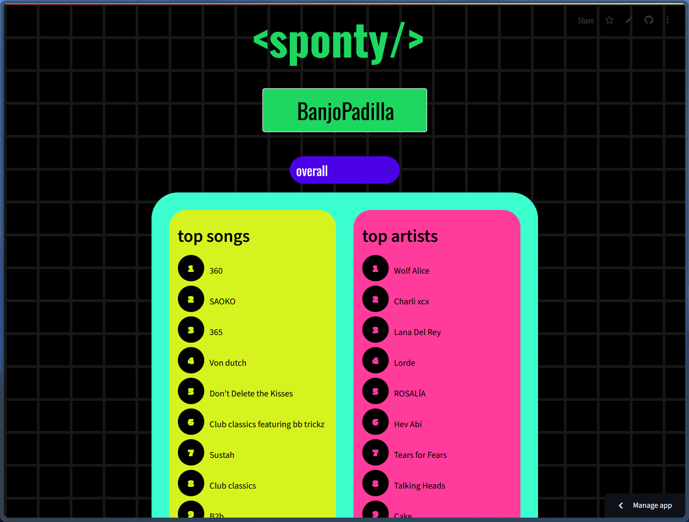

# Sponty: Visualize your listening history



## Overview

### Sponty is a web application that lets users explore and visualize their music listening habits. It connects to the Last.fm API to retrieve your top artists, songs, and tags, and presents them in a clean, interactive interface powered by Streamlit. The app is styled with custom CSS for a personalized and modern visual experience.

### 🌐 Try it live → [Sponty](https://sponty.streamlit.app/)

## Contents
- `main.py` – Main application logic for the Streamlit web app.
- `assets/style.css` – Custom stylesheet for styling Sponty’s user interface.
- `requirements.txt` – Python library dependencies.

## Features
- Fetches and displays your top artists, tracks, and genres (tags)
- Interactive pie charts and clean layout for an engaging experience
- Personalized interface styled with custom CSS

## Dependencies
Ensure the following Python libraries are installed:
- `pylast` – Python interface to Last.fm’s API
- `streamlit` – Web app framework
- `pandas` – Data manipulation
- `plotly` – Visualization and plotting

## Usage
- Run the app locally with Streamlit:
```
streamlit run main.py
```
- Enter your Last.fm username to see your listening insights.

## Note for Spotify Users
🔗 Reminder: If you're a Spotify user, you'll need to sign up for a Last.fm account and connect your Spotify to it. This allows Sponty to access your listening data.